# AI Teacher Bot - System Architecture Documentation

## Table of Contents
1. [System Overview](#system-overview)
2. [High-Level Architecture](#high-level-architecture)
3. [Component Architecture](#component-architecture)
4. [Data Flow Architecture](#data-flow-architecture)
5. [Technology Stack](#technology-stack)
6. [External Dependencies](#external-dependencies)
7. [Internal Dependencies](#internal-dependencies)
8. [3D Avatar System](#3d-avatar-system)
9. [Database Architecture](#database-architecture)
10. [API Architecture](#api-architecture)

---

## 1. System Overview

The AI Teacher Bot is a full-stack educational platform consisting of:
- **Frontend**: React + Vite + Three.js for 3D avatar rendering
- **Backend**: FastAPI for REST API and RAG processing
- **AI/ML**: Groq LLM + LangChain + ChromaDB for intelligent Q&A
- **3D Graphics**: Three.js + React Three Fiber for animated teacher avatars
- **Voice**: Web Speech API for speech recognition and synthesis

---

## 2. High-Level Architecture

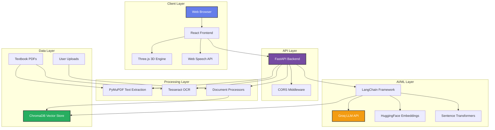

---

## 3. Component Architecture

### 3.1 Frontend Component Hierarchy

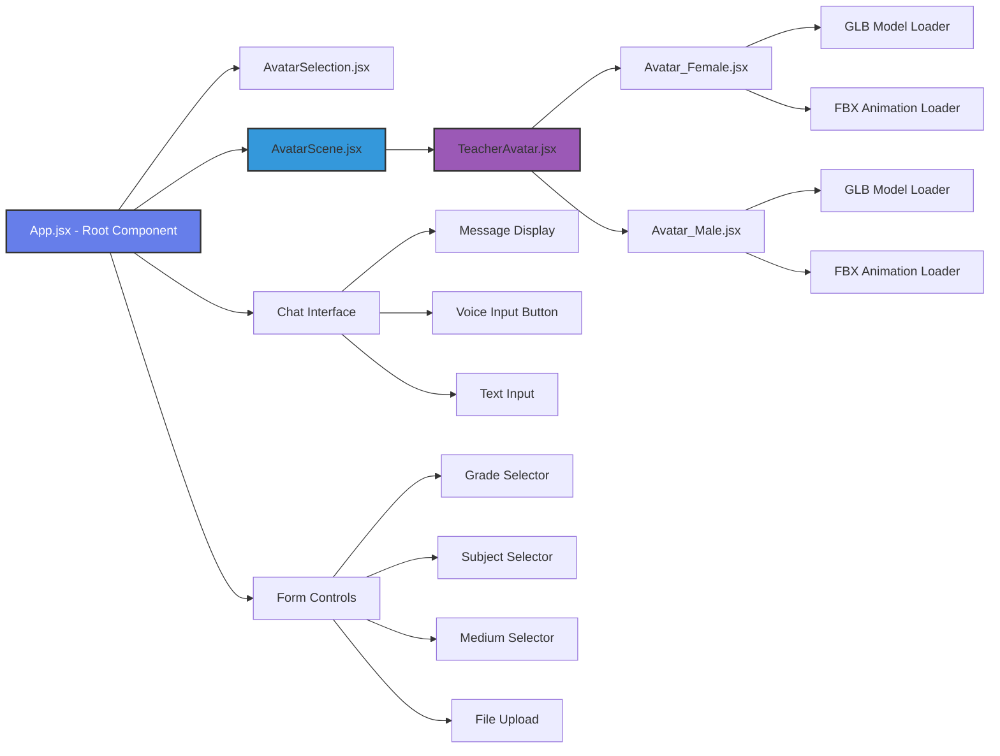


### 3.2 Backend Component Architecture

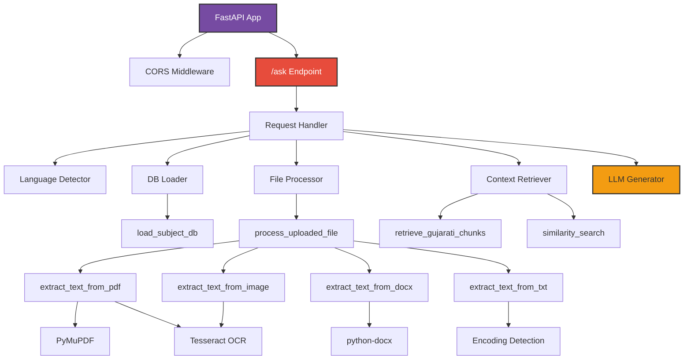

---

## 4. Data Flow Architecture

### 4.1 User Query Flow

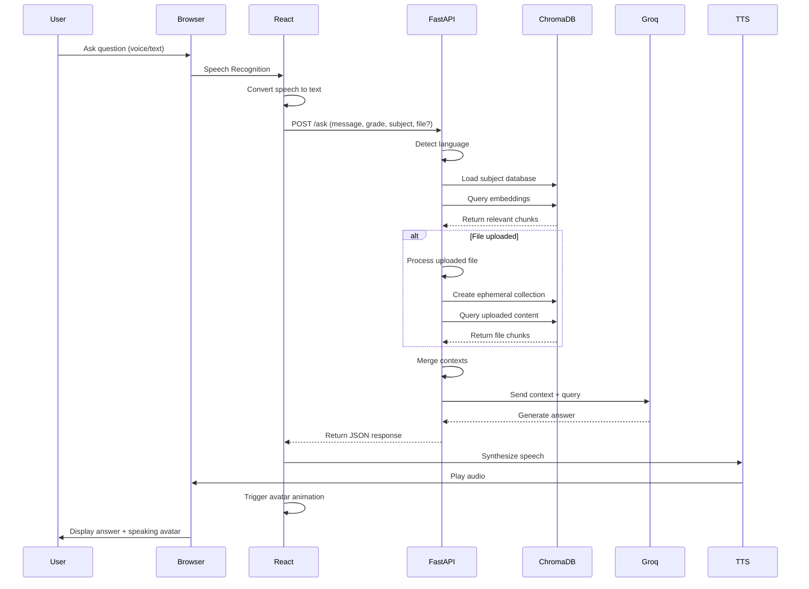


### 4.2 Document Processing Flow

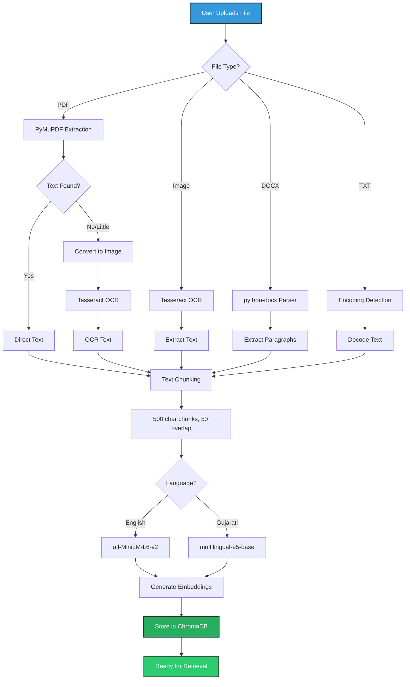

---

## 5. Technology Stack

### 5.1 Frontend Stack

```mermaid
graph TB
    subgraph "Build Tools"
        A[Vite 7.1.2]
        B[ESLint 9.33.0]
    end
    
    subgraph "Core Framework"
        C[React 19.1.1]
        D[React DOM 19.1.1]
        E[React Router 7.8.2]
    end
    
    subgraph "3D Graphics"
        F[Three.js 0.180.0]
        G[@react-three/fiber 9.4.0]
        H[@react-three/drei 10.7.6]
    end
    
    subgraph "Browser APIs"
        I[Web Speech API]
        J[SpeechRecognition]
        K[SpeechSynthesis]
    end
    
    A --> C
    C --> D
    C --> E
    C --> G
    F --> G
    G --> H
    I --> J
    I --> K
    
    style F fill:#000000,stroke:#333,stroke-width:2px,color:#fff
    style C fill:#61dafb,stroke:#333,stroke-width:2px
```


### 5.2 Backend Stack

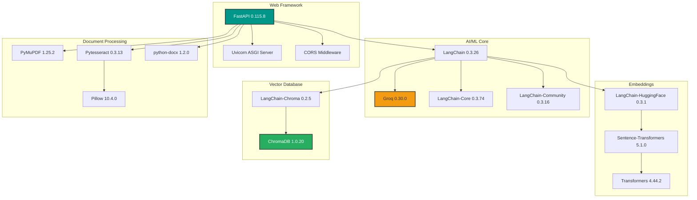

---

## 6. External Dependencies

### 6.1 Third-Party APIs

| Service | Purpose | Version/Model | Cost |
|---------|---------|---------------|------|
| **Groq API** | LLM Inference | llama-3.3-70b-versatile | Free tier available |
| **HuggingFace** | Embedding Models | sentence-transformers/all-MiniLM-L6-v2 | Free (open-source) |
| **HuggingFace** | Multilingual Embeddings | intfloat/multilingual-e5-base | Free (open-source) |
| **Tesseract OCR** | Text Extraction | 5.x with Gujarati support | Free (open-source) |
| **Web Speech API** | Voice I/O | Browser native | Free (browser built-in) |

### 6.2 External Assets

#### 6.2.1 3D Models (GLB Format)
- **Source**: Ready Player Me (RPM) or custom creation
- **Format**: GLB (GL Transmission Format Binary)
- **Files**:
  - `teacher_female.glb` - Female teacher avatar
  - `teacher_male.glb` - Male teacher avatar
- **Components**:
  - Skinned meshes (Wolf3D_Hair, Wolf3D_Body, Wolf3D_Outfit_Top, etc.)
  - Skeleton (Hips root bone)
  - Morph targets (facial expressions)
  - Materials (PBR textures)


#### 6.2.2 Animations (FBX Format)
- **Source**: Mixamo (Adobe's free animation library)
- **Format**: FBX (Filmbox)
- **Files**:
  - `Idle_Standing_female.fbx` - Female idle animation
  - `Talking_Standing_female.fbx` - Female talking animation
  - `Idle_Standing_male.fbx` - Male idle animation
  - `Talking_Standing_male.fbx` - Male talking animation
- **Skeleton**: Mixamorig (requires retargeting to RPM skeleton)
- **Animation Properties**:
  - Loop: Repeat
  - Transition: 0.5s fade in/out
  - Tracks: Position, rotation, scale keyframes

---

## 7. Internal Dependencies

### 7.1 Frontend Dependencies Deep Dive

#### **React Three Fiber (@react-three/fiber 9.4.0)**
- **Purpose**: React renderer for Three.js
- **Key Features Used**:
  - `Canvas` component for WebGL context
  - `useGraph` hook for scene graph traversal
  - `useFrame` hook for animation loop
  - Declarative 3D scene composition

#### **React Three Drei (@react-three/drei 10.7.6)**
- **Purpose**: Helper utilities for React Three Fiber
- **Key Features Used**:
  - `useGLTF` - GLB model loader with caching
  - `useFBX` - FBX animation loader
  - `useAnimations` - Animation mixer management
  - `OrbitControls` - Camera controls
  - `PerspectiveCamera` - Camera setup
  - Preloading utilities

#### **Three.js (0.180.0)**
- **Purpose**: Core 3D graphics library
- **Key Features Used**:
  - `SkeletonUtils` - Skeleton cloning for instancing
  - `KeyframeTrack` - Animation track creation
  - `LoopRepeat` - Animation looping
  - `SkinnedMesh` - Rigged character rendering
  - Lighting system (ambient, directional, spot, point)
  - Material system (PBR materials)

### 7.2 Backend Dependencies Deep Dive

#### **FastAPI (0.115.8)**
- **Purpose**: Modern Python web framework
- **Key Features Used**:
  - Async request handling
  - Form data parsing (`Form`, `UploadFile`)
  - Automatic API documentation (Swagger)
  - Type hints and validation
  - CORS middleware

#### **LangChain Ecosystem**
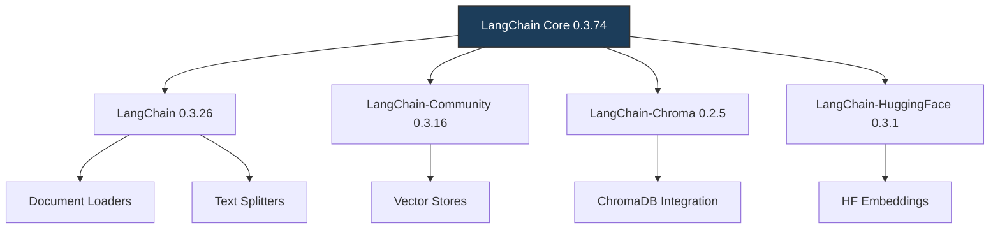


**LangChain Components Used:**
- `HuggingFaceEmbeddings` - Wrapper for sentence-transformers
- `Chroma` - Vector store wrapper with persistence
- `similarity_search()` - Semantic search method
- Document chunking utilities

#### **Sentence Transformers (5.1.0)**
- **Purpose**: State-of-the-art sentence embeddings
- **Models Used**:
  - `sentence-transformers/all-MiniLM-L6-v2` (English)
    - Dimensions: 384
    - Speed: Fast
    - Use case: English textbook embeddings
  - `intfloat/multilingual-e5-base` (Multilingual)
    - Dimensions: 768
    - Languages: 100+ including Gujarati
    - Use case: Gujarati textbook embeddings

#### **ChromaDB (1.0.20)**
- **Purpose**: Open-source vector database
- **Key Features Used**:
  - `PersistentClient` - Disk-based storage
  - `EphemeralClient` - In-memory temporary storage
  - `get_or_create_collection()` - Collection management
  - `query()` - Vector similarity search
  - `add()` - Document insertion with embeddings
  - Distance metrics (L2/Euclidean)

#### **Document Processing Libraries**

**PyMuPDF (1.25.2)**
- **Purpose**: PDF text extraction
- **Key Features Used**:
  - `fitz.open()` - PDF document loading
  - `page.get_text()` - Direct text extraction
  - `page.get_pixmap()` - Page to image conversion
  - Streaming support for large files

**Pytesseract (0.3.13)**
- **Purpose**: Python wrapper for Tesseract OCR
- **Key Features Used**:
  - `image_to_string()` - OCR text extraction
  - Multi-language support (`lang='guj+eng'`)
  - Image preprocessing integration

**Pillow (10.4.0)**
- **Purpose**: Image processing
- **Key Features Used**:
  - `Image.open()` - Image loading
  - Format conversion (PNG, JPEG, etc.)
  - BytesIO integration for in-memory processing

**python-docx (1.2.0)**
- **Purpose**: DOCX file parsing
- **Key Features Used**:
  - `Document()` - DOCX loading
  - Paragraph extraction
  - Text formatting preservation

---

## 8. 3D Avatar System

### 8.1 Avatar Pipeline Architecture

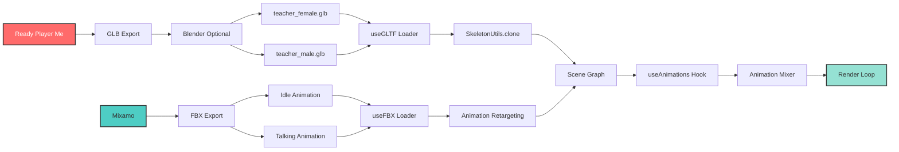


### 8.2 Avatar Component Structure

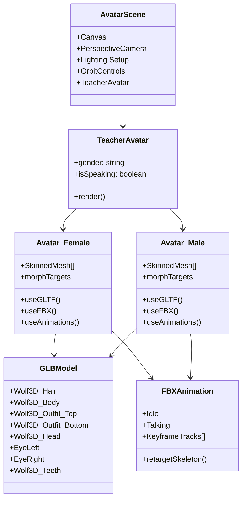

### 8.3 Animation Retargeting Process

The system uses a custom animation retargeting pipeline to map Mixamo skeleton to Ready Player Me skeleton:

```javascript
// Animation retargeting code
idle.tracks = idle.tracks.map(track => {
  // Remove mixamorig prefix from Mixamo skeleton
  const newName = track.name.replace('mixamorig', '');
  
  // Create new track with RPM skeleton naming
  return new THREE.KeyframeTrack(
    newName,           // Target bone name (RPM format)
    track.times,       // Keyframe timestamps
    track.values,      // Position/rotation/scale values
    track.interpolation // Interpolation method
  );
});
```

**Skeleton Mapping:**
- Mixamo: `mixamorig:Hips` → RPM: `Hips`
- Mixamo: `mixamorig:Spine` → RPM: `Spine`
- Mixamo: `mixamorig:Head` → RPM: `Head`
- And so on for all bones...

### 8.4 Lighting Configuration

```javascript
// Multi-light setup for realistic rendering
<ambientLight intensity={1.4} />                    // Global illumination
<directionalLight position={[2,4,3]} intensity={2.2} castShadow />  // Key light
<directionalLight position={[-2,2,-2]} intensity={0.8} />           // Fill light
<spotLight position={[0,4,1.5]} intensity={1.2} angle={0.5} />      // Rim light
<pointLight position={[0,1.5,2]} intensity={0.5} />                 // Face light
```


---

## 9. Database Architecture

### 9.1 Vector Database Structure

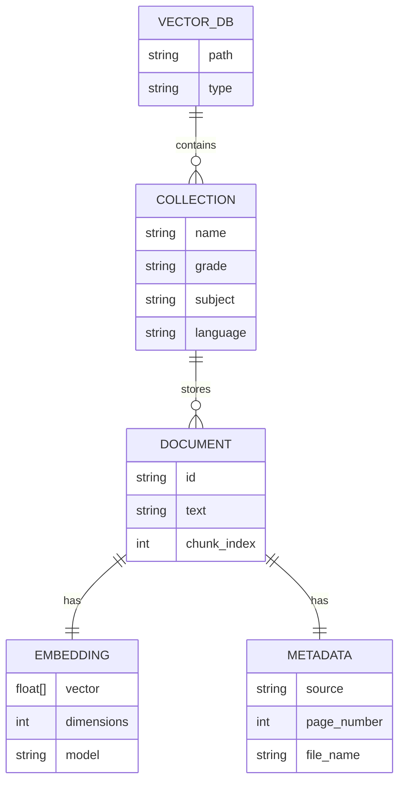

### 9.2 Database Organization

```
vector_db/
├── grade1_english_db/
│   └── textbook_db (collection)
├── grade1_maths_db/
│   └── textbook_db (collection)
├── grade2_english_db/
│   └── textbook_db (collection)
├── grade2_maths_db/
│   └── textbook_db (collection)
├── grade3_english_db/
│   └── textbook_db (collection)
├── grade3_maths_db/
│   └── textbook_db (collection)
├── grade3_evs_db/
│   └── textbook_db (collection)
├── grade1_gujarati_maths_db/
│   └── gujarati_textbook_db (collection)
├── grade1_gujarati_gujarati_db/
│   └── gujarati_textbook_db (collection)
├── grade2_gujarati_maths_db/
│   └── gujarati_textbook_db (collection)
├── grade2_gujarati_gujarati_db/
│   └── gujarati_textbook_db (collection)
├── grade3_gujarati_evs_db/
│   └── gujarati_textbook_db (collection)
├── grade3_gujarati_maths_db/
│   └── gujarati_textbook_db (collection)
└── grade3_gujarati_gujarati_db/
    └── gujarati_textbook_db (collection)
```

### 9.3 Embedding Strategy

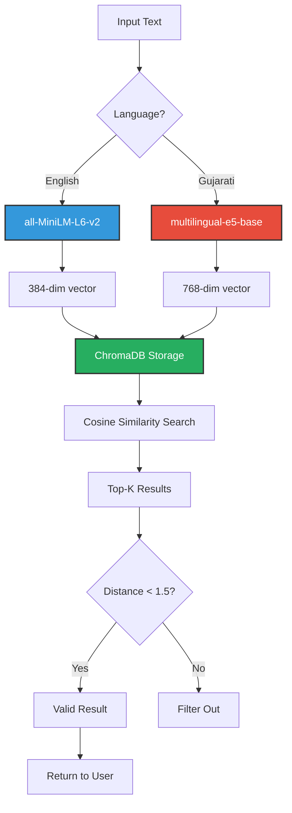


---

## 10. API Architecture

### 10.1 REST API Endpoints

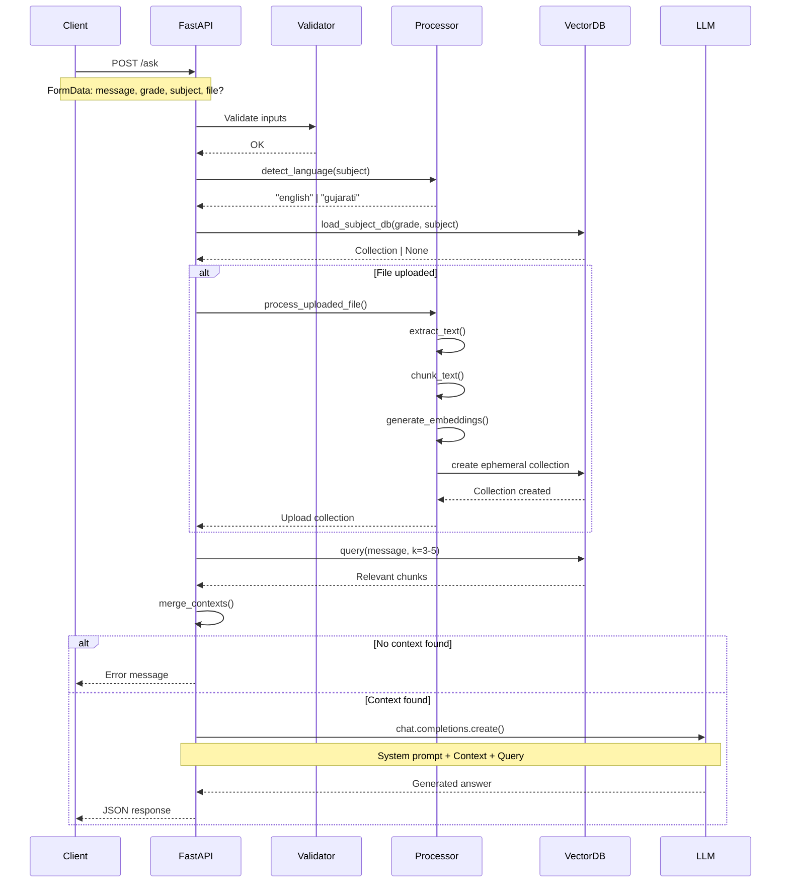

### 10.2 Request/Response Schema

**Request (POST /ask):**
```json
{
  "message": "What is photosynthesis?",
  "grade": "3",
  "subject": "EVS",
  "file": "<binary file data>" // Optional
}
```

**Response:**
```json
{
  "answer": "Photosynthesis is the process by which plants make their own food using sunlight, water, and carbon dioxide..."
}
```

**Error Response:**
```json
{
  "answer": "Sorry, I couldn't find this in your textbook or uploaded material."
}
```

### 10.3 Language-Specific Processing

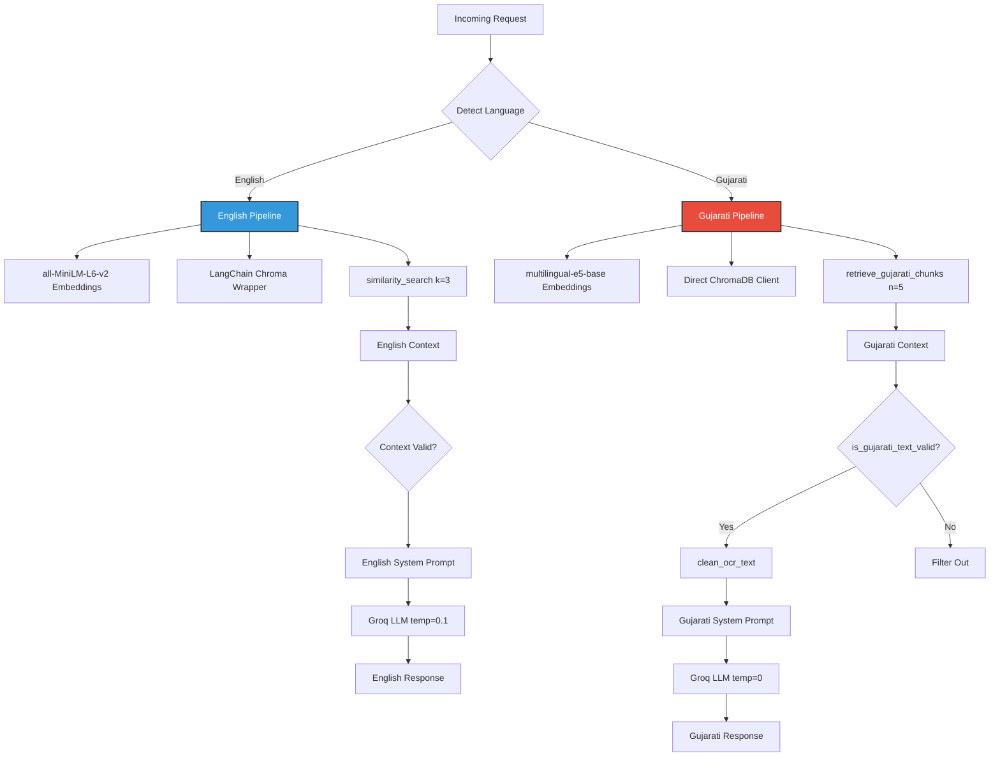


---

## 11. Voice System Architecture

### 11.1 Speech Recognition Flow

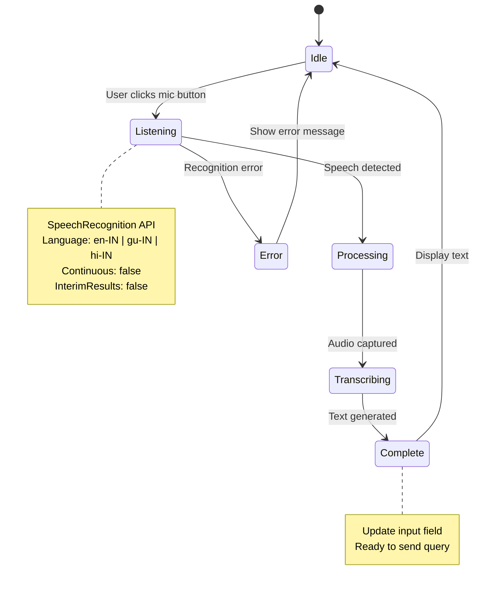

### 11.2 Text-to-Speech Flow

```mermaid
flowchart LR
    A[Bot Response] --> B[SpeechSynthesis API]
    B --> C{Select Voice}
    
    C --> D{Language?}
    D -->|English| E[Filter en-IN voices]
    D -->|Gujarati| F[Filter gu-IN voices]
    D -->|Hindi| G[Filter hi-IN voices]
    
    E --> H{Avatar Gender?}
    F --> H
    G --> H
    
    H -->|Female| I[Female voice profile]
    H -->|Male| J[Male voice profile]
    
    I --> K[Pitch: 1.1, Rate: 0.9]
    J --> L[Pitch: 0.9, Rate: 0.9]
    
    K --> M[Create Utterance]
    L --> M
    
    M --> N[Set isSpeaking=true]
    N --> O[Play Audio]
    O --> P[Trigger Avatar Animation]
    
    P --> Q{Audio Complete?}
    Q -->|Yes| R[Set isSpeaking=false]
    Q -->|No| P
    
    R --> S[Stop Avatar Animation]
    
    style B fill:#9b59b6,stroke:#333,stroke-width:2px,color:#fff
    style P fill:#3498db,stroke:#333,stroke-width:2px
```

### 11.3 Voice Configuration

```javascript
// Voice selection logic
const voices = speechSynthesis.getVoices();
const langPrefix = language.split('-')[0]; // 'en', 'gu', 'hi'
const languageVoices = voices.filter(v => v.lang.startsWith(langPrefix));

// Gender-specific voice selection
if (selectedAvatar === 'female') {
  selectedVoice = languageVoices.find(v => 
    v.name.includes('female') || 
    v.name.includes('Heera') ||  // Common Indian female voice
    v.name.includes('Nicky')
  );
} else {
  selectedVoice = languageVoices.find(v => 
    v.name.includes('male') || 
    v.name.includes('Rishi') ||  // Common Indian male voice
    v.name.includes('Prabhat')
  );
}
```

---

## 12. Security & Performance Considerations

### 12.1 Security Measures

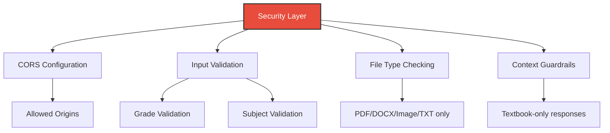

**Implemented Security:**
- CORS middleware restricts API access
- File type validation prevents malicious uploads
- LLM guardrails prevent hallucination
- No user data persistence (privacy-first)
- API key stored server-side only

### 12.2 Performance Optimizations

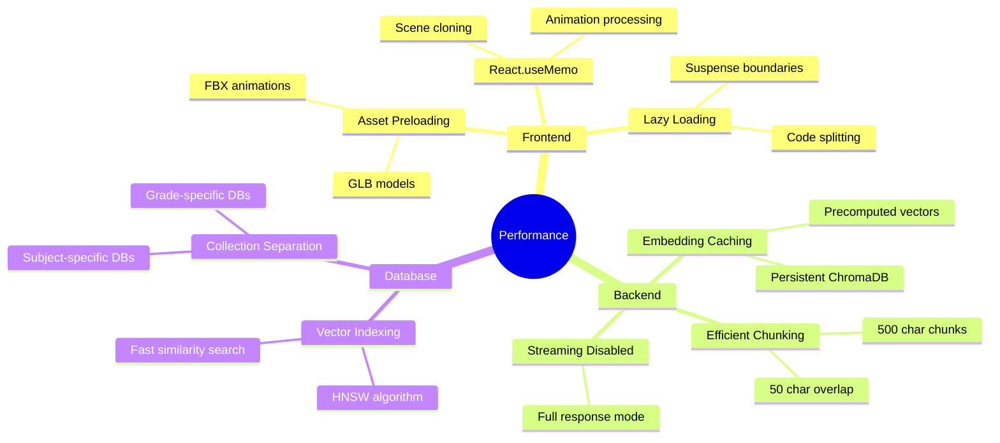


**Performance Metrics:**
- Model loading: ~2-3s (first load, then cached)
- Query response: ~1-3s (depends on LLM API)
- Animation switching: <500ms (smooth transitions)
- Voice synthesis: Real-time (browser native)

---

## 13. Deployment Architecture

### 13.1 Development Environment

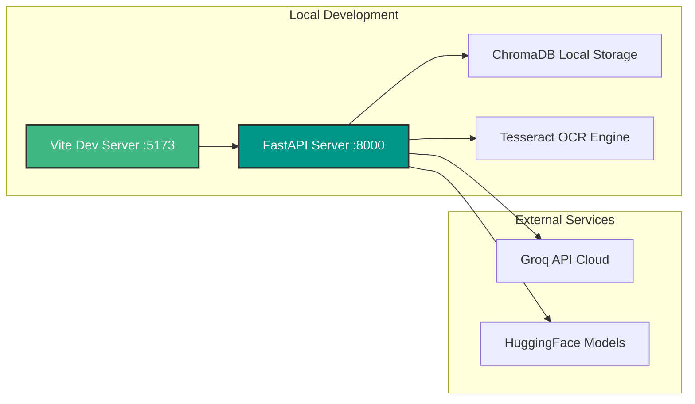

### 13.2 Production Deployment (Recommended)

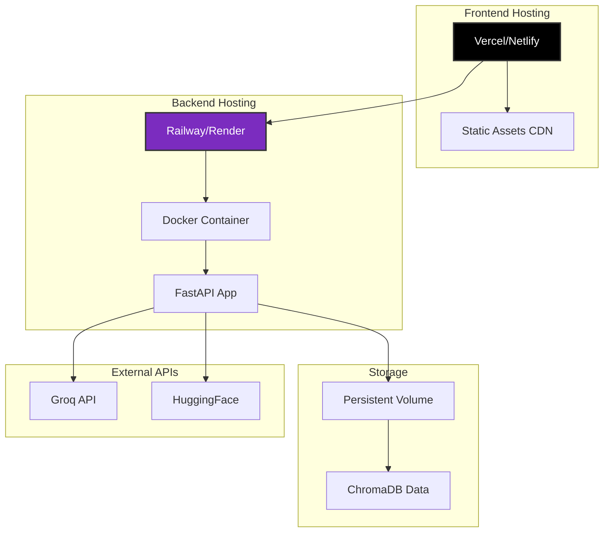

---

## 14. File Structure

```
project-root/
├── backend.py                          # FastAPI server
├── groq-rag.py                         # English RAG script
├── groq-rag-guj.py                     # Gujarati RAG script
├── requirements.txt                    # Python dependencies
│
├── my-app/                             # React frontend
│   ├── public/
│   │   ├── models/
│   │   │   ├── teacher_female.glb      # Female avatar model
│   │   │   └── teacher_male.glb        # Male avatar model
│   │   └── animations/
│   │       ├── Idle_Standing_female.fbx
│   │       ├── Talking_Standing_female.fbx
│   │       ├── Idle_Standing_male.fbx
│   │       └── Talking_Standing_male.fbx
│   │
│   ├── src/
│   │   ├── components/
│   │   │   ├── AvatarScene.jsx         # 3D canvas setup
│   │   │   ├── TeacherAvatar.jsx       # Avatar switcher
│   │   │   ├── Avatar_Female.jsx       # Female avatar component
│   │   │   ├── Avatar_Male.jsx         # Male avatar component
│   │   │   └── AvatarSelection.jsx     # Avatar picker UI
│   │   ├── App.jsx                     # Main app component
│   │   ├── App.css                     # Styles
│   │   └── main.jsx                    # Entry point
│   │
│   ├── package.json                    # Node dependencies
│   └── vite.config.js                  # Vite configuration
│
├── textbooks/                          # Source textbooks
│   ├── english/
│   │   ├── grade1/
│   │   ├── grade2/
│   │   └── grade3/
│   └── gujarati/
│       ├── grade1/
│       ├── grade2/
│       └── grade3/
│
└── vector_db/                          # ChromaDB storage
    ├── grade1_english_db/
    ├── grade1_maths_db/
    ├── grade3_gujarati_evs_db/
    └── ...
```

---

## 15. Dependency Version Matrix

### 15.1 Frontend Dependencies

| Package | Version | Purpose | License |
|---------|---------|---------|---------|
| react | 19.1.1 | UI framework | MIT |
| react-dom | 19.1.1 | React renderer | MIT |
| react-router-dom | 7.8.2 | Routing | MIT |
| three | 0.180.0 | 3D graphics | MIT |
| @react-three/fiber | 9.4.0 | React Three.js renderer | MIT |
| @react-three/drei | 10.7.6 | Three.js helpers | MIT |
| vite | 7.1.2 | Build tool | MIT |
| eslint | 9.33.0 | Linter | MIT |


### 15.2 Backend Dependencies

| Package | Version | Purpose | License |
|---------|---------|---------|---------|
| fastapi | 0.115.8 | Web framework | MIT |
| groq | 0.30.0 | LLM API client | Apache 2.0 |
| langchain | 0.3.26 | LLM orchestration | MIT |
| langchain-core | 0.3.74 | Core abstractions | MIT |
| langchain-community | 0.3.16 | Community integrations | MIT |
| langchain-chroma | 0.2.5 | ChromaDB integration | MIT |
| langchain-huggingface | 0.3.1 | HuggingFace integration | MIT |
| chromadb | 1.0.20 | Vector database | Apache 2.0 |
| sentence-transformers | 5.1.0 | Embeddings | Apache 2.0 |
| transformers | 4.44.2 | Model loading | Apache 2.0 |
| PyMuPDF | 1.25.2 | PDF processing | AGPL |
| pytesseract | 0.3.13 | OCR wrapper | Apache 2.0 |
| pillow | 10.4.0 | Image processing | HPND |
| python-docx | 1.2.0 | DOCX parsing | MIT |

---

## 16. Key Technical Decisions

### 16.1 Why These Technologies?

**Frontend:**
- **React 19**: Latest features, concurrent rendering, improved performance
- **Three.js**: Industry standard for WebGL, extensive ecosystem
- **React Three Fiber**: Declarative 3D, better than imperative Three.js
- **Vite**: Faster than Webpack, better DX, native ESM support

**Backend:**
- **FastAPI**: Async support, automatic docs, type safety, fast
- **Groq**: Fastest LLM inference (500+ tokens/sec), free tier
- **LangChain**: Abstracts RAG complexity, extensive integrations
- **ChromaDB**: Lightweight, embeddable, no separate server needed
- **Sentence Transformers**: SOTA embeddings, easy to use

**3D Assets:**
- **Ready Player Me**: Free, customizable, web-optimized avatars
- **Mixamo**: Free animations, large library, easy retargeting
- **GLB format**: Compressed, single file, web-optimized
- **FBX format**: Industry standard, preserves animation data

### 16.2 Architecture Trade-offs

| Decision | Pros | Cons | Mitigation |
|----------|------|------|------------|
| Client-side 3D rendering | No server GPU needed, interactive | Performance varies by device | Optimized models, LOD |
| Separate vector DBs per subject | Fast queries, organized | More storage | Acceptable for local deployment |
| Ephemeral collections for uploads | No persistence needed | Reprocess each time | Fast enough for small files |
| Browser Speech API | Free, no backend needed | Limited voice quality | Acceptable for MVP |
| Groq API | Fast, free tier | External dependency | Fallback to local LLM possible |

---

## 17. Future Architecture Enhancements

### 17.1 Planned Improvements

```mermaid
mindmap
  root((Future Enhancements))
    Scalability
      Microservices
        Separate embedding service
        Separate LLM service
      Load Balancing
        Multiple FastAPI instances
      Caching Layer
        Redis for responses
    Features
      Advanced Animations
        Lip-sync with phonemes
        Gesture recognition
      Multi-user
        WebSocket chat rooms
        Collaborative learning
      Analytics
        Learning progress tracking
        Knowledge gap analysis
    Performance
      Edge Deployment
        Cloudflare Workers
        Edge caching
      Model Optimization
        Quantized embeddings
        Smaller LLMs
    Accessibility
      Offline Mode
        Local LLM (Ollama)
        IndexedDB storage
      Mobile App
        React Native port
        Native animations
```

### 17.2 Scalability Roadmap

**Phase 1: Current (MVP)**
- Single server deployment
- Local vector database
- Synchronous processing

**Phase 2: Horizontal Scaling**
- Multiple FastAPI workers
- Shared ChromaDB instance
- Redis caching layer

**Phase 3: Microservices**
- Separate embedding service
- Separate LLM gateway
- Message queue (RabbitMQ/Kafka)

**Phase 4: Edge Computing**
- CDN for static assets
- Edge functions for API
- Distributed vector stores

---

## 18. Troubleshooting Guide

### 18.1 Common Issues

| Issue | Cause | Solution |
|-------|-------|----------|
| Avatar not loading | Missing GLB files | Check `/public/models/` directory |
| Animations not playing | Skeleton mismatch | Verify retargeting code |
| OCR poor quality | Low-res scans | Use 300+ DPI PDFs |
| Gujarati text garbled | Missing fonts | Install Gujarati Unicode fonts |
| Voice not working | Browser compatibility | Use Chrome/Edge |
| Slow queries | Large context | Reduce chunk size or k value |
| CORS errors | Wrong origin | Update FastAPI CORS settings |

### 18.2 Debug Commands

```bash
# Check Python dependencies
pip list | grep -E "fastapi|groq|langchain|chroma"

# Test Tesseract OCR
tesseract --list-langs

# Check ChromaDB collections
python -c "import chromadb; client = chromadb.PersistentClient(path='./vector_db/grade3_evs_db'); print(client.list_collections())"

# Test Groq API
curl -X POST https://api.groq.com/openai/v1/chat/completions \
  -H "Authorization: Bearer YOUR_API_KEY" \
  -H "Content-Type: application/json" \
  -d '{"model":"llama-3.3-70b-versatile","messages":[{"role":"user","content":"Hello"}]}'
```

---

## 19. References & Resources

### 19.1 Official Documentation

- **Three.js**: https://threejs.org/docs/
- **React Three Fiber**: https://docs.pmnd.rs/react-three-fiber/
- **FastAPI**: https://fastapi.tiangolo.com/
- **LangChain**: https://python.langchain.com/
- **ChromaDB**: https://docs.trychroma.com/
- **Groq**: https://console.groq.com/docs/
- **Sentence Transformers**: https://www.sbert.net/

### 19.2 Asset Sources

- **Ready Player Me**: https://readyplayer.me/
- **Mixamo**: https://www.mixamo.com/
- **Tesseract OCR**: https://github.com/tesseract-ocr/tesseract

### 19.3 Learning Resources

- **Three.js Journey**: https://threejs-journey.com/
- **LangChain Cookbook**: https://github.com/langchain-ai/langchain/tree/master/cookbook
- **RAG Tutorial**: https://www.pinecone.io/learn/retrieval-augmented-generation/

---

**Document Version:** 1.0  
**Last Updated:** October 31, 2025  
**Author:** AI Teacher Bot Development Team  
**License:** Educational Use
